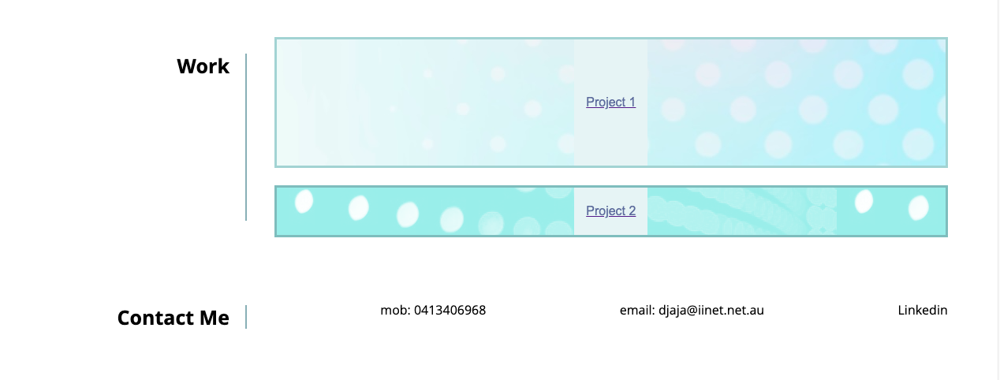

# portfolio

## Description
In this portfolio I would like to display my best work, also to let people know why I choose to learn about Web Developtment. I am willing to learn how to build a good website from scracth, it will be long way to go for me, because I am just started doing computer and coding at the same time. With my basic knowledge of computer and coding, at least I can start to make a simple portfolio. I learn a lot from creating my first portfolio, especially about CSS and HTML. Unfortunately I don't have any web application to display, so I replace it with a placeholder image for 'project 1' and google slide for 'project 2'. For sure I will create my own web application in the future. In this simple portfolio, I try to make the presentation look propotional and the color matching. The about me section, I explain my current situation, also after 3 weeks doing course I start to enjoy doing coding. On the CSS I have "helper.css, reset.css, styles.css and variable.css" For the font I use open sans font is a humanist sans serif typeface designed by Steve Matteson from Google Fonts. I make the color of the navigation is linear-gradient 90 deg from green to purple. I implement media queries in my portfolio, if the browser window is 600px or smaller, the background color will be light green. On the nav bar I use display: flex, flax-wrap: wrap, flex-direction: row. On the html, 'hero' section I made 3 section: About me, Work and Contact. I made a vertical line next to About me, Work and Contact on the 'page >h2' border-right: 2px solid color light green rgb(136, 175, 182).
  
  
## Demo

## Live Link
https://github.com/B-smd/portfolio.git

"https://picsum.photos/1000/500" 

https://docs.google.com/presentation/d/e/2PACX-1vRgj_VUzYj3fhmCJHxSXIsC7YinDXncpVV4rAzJsKkrfbF0G19lQgpwqcmfyBYx_KPI6mGdswg9q9OF/pub?start=false&loop=false&delayms=3000 

## Technologies Used
- CSS
- HTML

## Usage
This website is simple but elegant. I am presented my name with my a recent photo (cartoon style). When you click one of the link in navigation, then the UI scrolls to the corresponding section. When you click on the project 1 that application image will appear link to the placeholder image from picsum.photo. When you click on the project 2 that application image will appear link to the google slide

## Contributing
Pull request are welcome, you can make a contribution at the bottom of any docs page to make small changes such as a typo, sentence fix or a broken link. For major changes, please open an issue first to discuss what you would like to change.

## Licence
[MIT]
(https)://choosealicence.com/licences/mit/)

